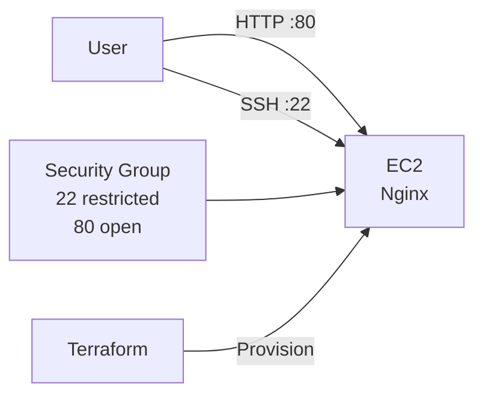

# Cloud Ops Lab (AWS)


Terraform으로 AWS(Seoul) 환경에 EC2를 프로비저닝하고, <br/>
user_data로 Nginx를 자동 설치/기동하여<br/>
운영 가능한 형태로 배포 → 검증 → 정리(destroy)까지 수행한 미니 랩입니다.

---

## 🧩 Architecture


## ⚙️ Tech Stack
### Core


-E95420?style=flat-square&logo=ubuntu&logoColor=white)


### Automation / CI


<details>
<summary><b>Also used (project context)</b></summary>

- **AWS CLI**: credentials 설정 및 계정 검증(`aws sts get-caller-identity`)
- **cloud-init / user_data**: EC2 부팅 시 Nginx 자동 설치 및 기동
- **curl / systemctl / ss**: 서비스/포트/응답 검증

</details>

## ✅ What I did (Ops-focused)
- **IaC**: Terraform으로 EC2 + Security Group 구성 재현
- **Access Control**: SSH(22)는 내 IP만 허용, HTTP(80)는 전체 허용
- **Auto Provisioning**: user_data로 Nginx 자동 설치/기동 및 기본 페이지 배포
- **Verification**: curl/리스닝/서비스 상태로 정상 응답 확인
- **Cost Control**: 실습 후 terraform destroy로 리소스 정리

## 🚀 How to Run
### 1) Prerequisites
- AWS credentials configured (aws configure)
- EC2 Key Pair created in ap-northeast-2 (Seoul)

### 2) Apply
```bash
cd terraform
terraform init
terraform fmt -recursive
terraform validate

terraform apply \
  -var="key_name=<YOUR_KEYPAIR_NAME>" \
  -var="ssh_cidr=<YOUR_PUBLIC_IP>/32"
```

### 3) Verify
```bash
terraform output -raw url
curl -I "$(terraform output -raw url)"
```

### 4) Destory
```bash
terraform output -raw url
curl -I "$(terraform output -raw url)"
```

### 🧾 Evidence (Optional)
- evidence/terraform_apply.txt
- evidence/terraform_output.txt
- evidence/curl_head.txt

### 🔒 Security / Compliance Notes (ISMS/CSAP mindset)
- SSH 접근은 My IP only로 제한(원격관리 접근통제)
- 인프라 변경은 Terraform 코드로 관리(변경관리/추적성)
- 서비스 상태/포트/응답으로 운영 검증 절차 문서화

