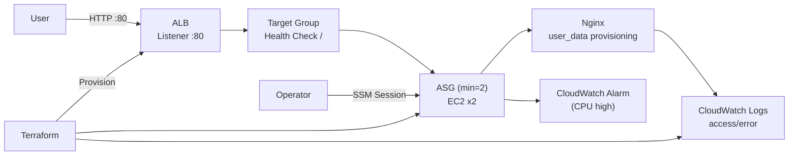

# Cloud Ops Lab (AWS)


-232F3E?style=flat-square&logo=amazonaws&logoColor=white)


Terraform으로 AWS(Seoul) 환경에 **ALB + Auto Scaling Group(2대)** 기반 Nginx 서비스를 구성하고,  
**CloudWatch 로그/알람**으로 관측성을 추가한 뒤, **SSM(Session Manager) 기반 접속으로 SSH를 제거**한 운영형 미니 랩입니다.

---

## 🧩 Architecture

```mermaid
flowchart LR
  U[User] -->|HTTP :80| ALB["ALB<br/>Listener :80"]
  ALB --> TG["Target Group<br/>Health Check /"]
  TG --> ASG["ASG (min=2)<br/>EC2 x2"]
  ASG --> N["Nginx<br/>user_data provisioning"]
  N --> CW["CloudWatch Logs<br/>access/error"]
  ASG --> ALARM["CloudWatch Alarm<br/>(CPU high)"]
  OP["Operator"] -->|SSM Session| ASG
  TF["Terraform"] -->|Provision| ALB
  TF --> ASG
  TF --> CW
```

## ⚙️ Tech Stack
### Core


-E95420?style=flat-square&logo=ubuntu&logoColor=white)


### Automation / CI


<details>
<summary><b>Implementation details</b></summary>
  
- **Provisioning**: user_data로 Nginx 자동 설치/기동 + 기본 페이지 배포
- **Observability**: Nginx access/error 로그를 CloudWatch Logs로 전송, CPU 알람 구성
- **Access Control**: SSH 인바운드 제거, SSM(Session Manager) 기반 운영 접속
- **Verification**: ALB endpoint에 대해 curl로 200 OK 확인
- **Cost Control**: 실습 후 terraform destroy로 리소스 정리
  
</details>

## ✅ What I did (Ops-focused)

- **High Availability**: ALB + ASG(min=2)로 단일 인스턴스 장애를 흡수하는 구성
- **Auto Provisioning**: 인스턴스 부팅 시 Nginx 자동 설치/기동(user_data)
- **Health Check**: Target Group 헬스체크(/) 기반으로 인스턴스 상태 관리
- **Observability**: CloudWatch Logs로 Nginx 로그 수집 + retention 설정, CPU 알람 구성
- **Access Control**: SSH(22) 제거 후 SSM(Session Manager)로 운영 접속 전환
- **IaC/Change Management**: Terraform 코드로 변경 이력 관리 + GitHub Actions로 fmt/validate 자동 검증

## 🚀 How to Run
### 1) Prerequisites
- AWS credentials configured (aws configure)
- Region: ap-northeast-2 (Seoul)

Note: SSM 전환 이후에는 Key Pair/SSH가 필수가 아닙니다.
(만약 Launch Template에 key_name을 남겨두었다면 Key Pair가 필요합니다.)

### 2) Apply
```bash
cd terraform
terraform init
terraform fmt -recursive
terraform validate
terraform apply
```

### 3) Verify (ALB endpoint)
```bash
terraform output -raw url
curl -I "$(terraform output -raw url)"
```

### 4) Verify (CloudWatch Logs / Alarm)
```bash
# Log groups
aws logs describe-log-groups \
  --region ap-northeast-2 \
  --log-group-name-prefix "/cloud-ops-mini-lab" \
  --output table

# Alarm (example name)
aws cloudwatch describe-alarms \
  --region ap-northeast-2 \
  --alarm-name-prefix "cloud-ops-mini-lab" \
  --output table
```

### 5) Verify (SSM Managed Nodes)
```bash
aws ssm describe-instance-information \
  --region ap-northeast-2 \
  --query "InstanceInformationList[].{Id:InstanceId,Ping:PingStatus,Platform:PlatformName,Agent:AgentVersion}" \
  --output table
```

### 6) Destory
```bash
terraform destroy
```

### 🧾 Evidence
- evidence/terraform_apply.txt
- evidence/terraform_output.txt
- evidence/curl_alb_head.txt
- evidence/cw_log_groups.txt
- evidence/cw_alarm.json

### 🔒 Security / Compliance Notes (ISMS/CSAP mindset)
- **접근통제**: SSH 인바운드 제거, SSM(Session Manager) 기반 운영 접속
- **로그 관리**: CloudWatch Logs로 Nginx 로그 중앙 수집 + 보관기간(retention) 설정
- **변경관리/추적성**: 인프라 변경은 Terraform 코드로 관리(리뷰/이력 기반 운영 가능)
- **운영 검증**: ALB endpoint 응답(200 OK) 및 헬스체크로 정상 상태 확인

### 🧹 Notes
- 본 랩은 비용 방지를 위해 실습 후 terraform destroy를 권장합니다.
- Default VPC 기반 구성으로 시작했으며, 향후 Custom VPC로 확장 가능합니다.
